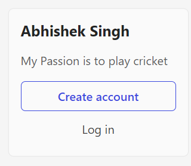

# Dom Manipulation Assignment

1. Webiste Name: [Dev To](https://dev.to/)

### Topics

    - Query Selctory, Inner HTML

### Sample Image


### Tasks

        Target the Top description div and change the DEV Community to <Your_Name> and description to your passion

### Output
``` javascript
let heading = document.querySelector(".side-bar .crayons-card .crayons-subtitle-2");

heading.innerText = "Abhishek Singh";

let desc = document.querySelector(".side-bar .crayons-card .color-base-70");

desc.innerText = "My Passion is to play cricket";

```



2. Website Name: [Apple](https://support.apple.com/en-in)

### Task


### Fetch all the product name and store in an array

``` javascript
const arr = [];
document.querySelectorAll(".row .as-imagegrid-item").forEach((ele)=>{
    arr.push(ele.innerText.replace("\nSupport",""));
});
arr;
```

### Output

['iPhone', 'Mac', 'iPad', 'Watch', 'AirPods', 'Music', 'TV']

3. Webiste Name: [Youtube Support](https://support.google.com/youtube/)

### Topics

    - Get Element By Id, Create Element, Create Text Node, Append Child

### Sample Image


### Tasks

     Add another FAQ 'My New FAQ' to the list

``` javascript
let outer = document.getElementsByClassName("accordion-homepage");

let ele = document.createElement("h3");

ele.innerText = "My New FAQ";

let sec = document.createElement("section");

sec.appendChild(ele);

sec.classList.add("parent");

outer[0].appendChild(sec);

```

### Output


4. Webiste Name: [OnePlus](https://www.oneplus.in/support)

### Topics

     Query Selector, InnerText

### Sample Image


### Tasks

      Change the contact number

``` javascript
let contact = document.querySelector(".one-tel-number.service-number");
contact.innerText = "+91 6366256689";
```

### Output


5. Webiste Name: [Samsung](https://www.samsung.com/in/offer/online/samsung-fest/)

### Topics

       getElementById, createElement, InnerText, append, setAttribute

### Sample Image


### Tasks

     Target the main div of card and change the Button text to Check out

``` javascript
let btn = document.querySelectorAll(".diwali-deals-product-sale-btn");
btn.forEach(element => {
    element.innerText = "Check Out";
});
```

### Output


6. Webiste Name: [Adidas](https://www.adidas.co.in/)

### Topics

    -   Query Selector, Event listeners, Changing Styles

### Sample Image


### Tasks

     Target the search box and on hover change thebackground color to red.

``` javascript
let change = document.querySelector(".searchinput___zXLAR");
change.addEventListener("mouseover", (ele)=>{
    ele.target.style.backgroundColor = "Red";
});
// The target property is a reference to the object (element) on which the event was dispatched.
```

### Output


7. Webiste Name: [MDN Web Docs](https://developer.mozilla.org/en-US/)

### Topics

       Form, Value, Submit

### Sample Image


### Tasks

     To Search a topic in the MDN Search bar.
     First add a text to search in the search bar and then hit the submit search button to search the docs using DOM

```javascript
const input = document.getElementById("top-nav-search-input");
const btn = document.querySelector(".search-button");

btn.addEventListener("mouseover", () => {
  input.value = "javascript event";
  btn.click();
});
```
### Output


8. Webiste Name: [Google](https://www.google.com/)

### Topics

       Remove Elements

### Sample Image


### Tasks

     Remove alternate languages from the home page languages listed

```javascript
let ele = document.querySelector(".z4hgWe");

let all = ele.childNodes;

for(let i = 0; i<all.length; i += 3){
    all[i].remove();
}

for(let i = 0; i<all.length; i += 2){
    all[i].remove();
}
```

### Output


9. Webiste Name: [Code Wars](https://www.codewars.com/)

### Topics

       Change Font Family, Color of Text.

### Sample Image


### Tasks

    Change the font family of the text to monospace and text color to the logo’s background color.

```javascript
let ele = document.querySelector(".display-heading-1");

ele.style.fontFamily = "monospace";

ele.style.color = "#B1361E";
```

### Output


10. Webiste Name: [Freecodecamp](https://www.freecodecamp.org/)

### Topics

       querySelector, mouseover, click eventListener,  callback function, style,

### Sample Image


### Tasks

    Target the button and change background colour on mouseover

```javascript
let ele = document.querySelector(".btn-cta-big .login-btn-text");

ele.addEventListener("mouseover",(val)=>{
    val.target.style.backgroundColor = 'Red';
});
```

### Output


11. Webiste Name: [realme](https://www.realme.com/in/)

### Topics

       querySelector,style,background-image

### Sample Image


### Tasks

    change the realme logo to ineuron logo

```javascript
let ele = document.querySelector(".icon.icon-logo.in");

ele.style.backgroundImage = "url('https://ineuron.ai/images/ineuron-logo.png')";

```

### Output


12. Webiste Name: [Github](https://github.com/)

### Topics

       querySelector,style,background-Color

### Sample Image


### Tasks

     change the background colour of the button to blue.

```javascript
let ele = document.querySelector(".js-repos-container .btn.btn-sm.btn-primary");

ele.style.backgroundColor = 'Blue';

```

### Output


13. Webiste Name: [Hackerrank](https://www.hackerrank.com/)

### Topics

       querySelector,innerHtml

### Sample Image


### Tasks

Target the top description and change “Matching developers with great companies” to ‘JSBOOTCAMP“.

```javascript
let ele = document.querySelector(".fl-heading-text");

ele.innerText = "JSBOOTCAMP";

```

### Output


14. Webiste Name: [Asus](https://www.asus.com/in/)

### Topics

      querySelector,style,font-size

### Sample Image


### Tasks

       change the fontsize of “Hot Deals” to 80px

```javascript
let ele = document.querySelector(".HotDealsAll__Heading__2fIbe");
ele.style.fontSize = "80px";

```

### Output


15. Webiste Name: [Dell](https://www.dell.com/en-in/shop/deals/laptop-deals?gacd=10415953-9016-5761040-285981356-0&dgc=ST&gclid=Cj0KCQjwguGYBhDRARIsAHgRm4-XUDMhhVNyHXb3s1gY4ZBzORr_d9Se-buhJwy7asyUe7YdqEA11eEaAt6UEALw_wcB&gclsrc=aw.ds&nclid=BxjBlpBQsX6pjSHh-L8YYSU77EpfXRkG1AGMB5Wbeu386ykspfrPDnfx_DdFau20)

### Topics

      querySelector,style.textAlign

### Sample Image


### Tasks

       Convert the text “G15 Gaming Laptop” from left to right

```javascript
let ele = document.querySelector(".ps-image.ps-product-image a");

ele.style.textAlign = "right";
```

### Output


16. Webiste Name: [Vercel](https://vercel.com/)

### Topics

     querySelector,innerHTMl

### Sample Image


### Tasks

      change the heading “Start with the developer” to “Start with Scratch”

```javascript
let ele = document.querySelector(".section-title_title__VEDfK");

ele.innerText = "Start With Scratch";
```

### Output


17. Webiste Name: [Sony](https://www.sony.co.in/)

### Topics

    querySelector,innerHTMl

### Sample Image


### Tasks

     change the button text To current Date.

```javascript
let ele = document.querySelector(".btn-container");

ele.innerHTML = Date();
```

### Output


18. Webiste Name: [Philips](https://www.philips.co.in/)

### Topics

     querySelector,style,backgroundcolor

### Sample Image


### Tasks

    change the background colour blue to orange

```javascript
let ele = document.querySelector(".p-f03-footer-container");

ele.style.background = "none";

ele.style.backgroundColor = 'Orange';

```

### Output


19. Webiste Name: [Canon](https://in.canon/)

### Topics

          querySelector,src

### Sample Image


### Tasks

    extract the canon logo

```javascript
let ele = document.querySelector(".logo");

console.log(ele.src);
```

### Output


20. Webiste Name: [Oppo](https://www.oppo.com/in/)

### Topics

          querySelector,style,color

### Sample Image


### Tasks

      Change the description colour black to orange

```javascript
let ele = document.querySelectorAll(".desc");

ele.forEach((el)=>{
    el.style.color = 'Orange';
});
```

### Output


